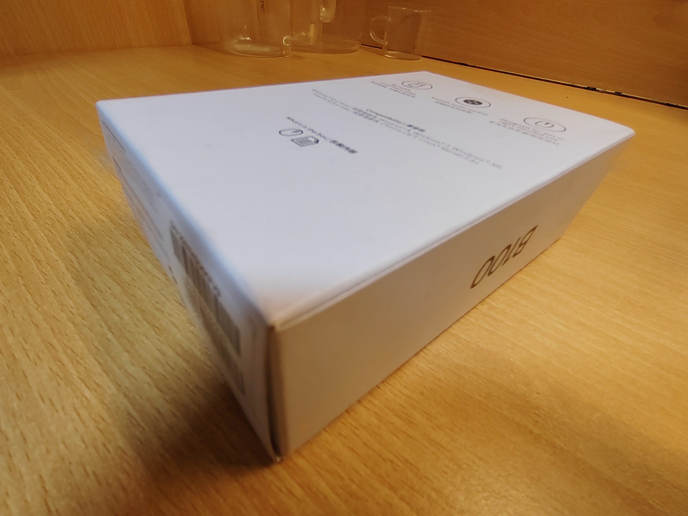
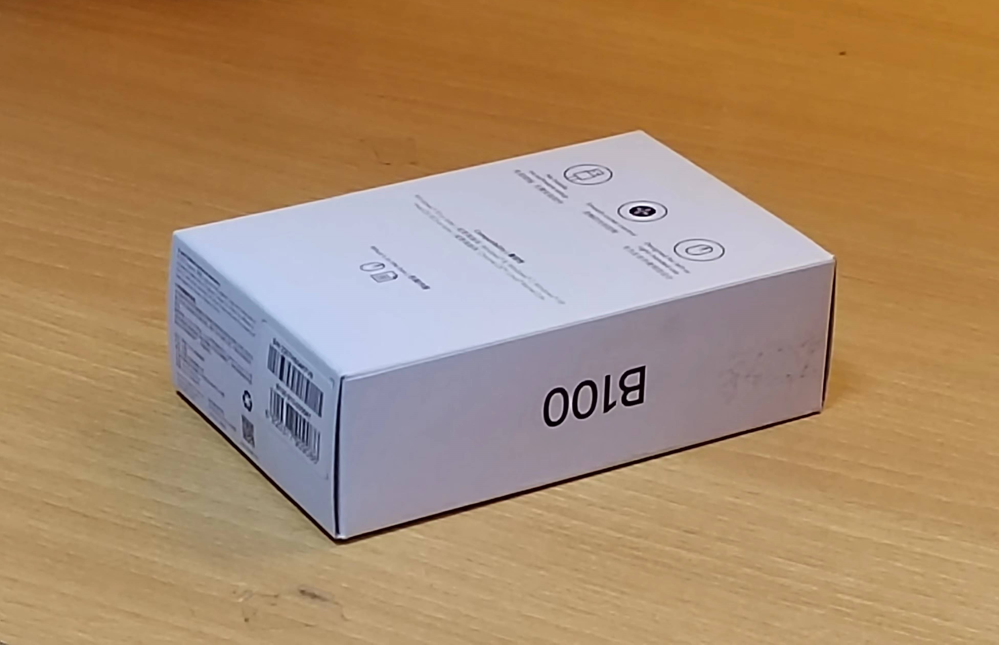
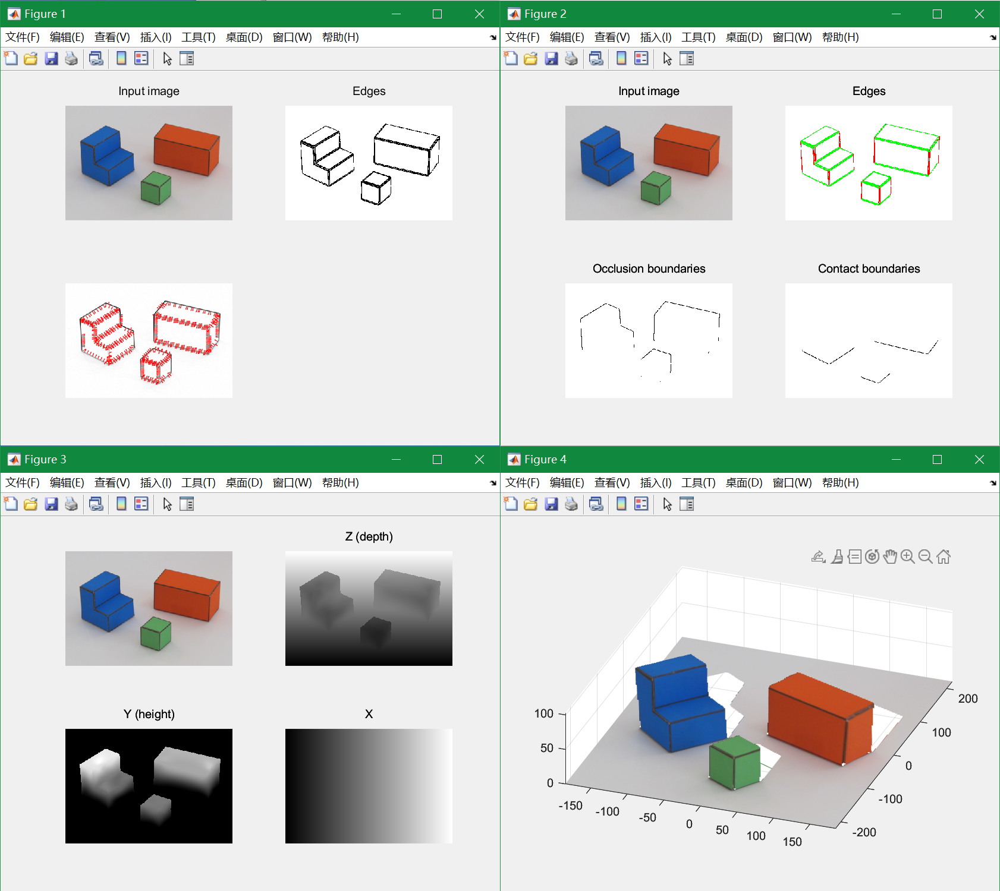

<h2>问题包-1</h2>

520030910246 薛家奇

 

2. **请拍摄两张覆盖相同场景内容的照片，一张具有明显的透视投影特征，另一张则具有近似的正交投影特征。照片可以拍摄自真实场景，也可以用“simpleWorld.pdf”中的图片道具自制简单场景（最好用亚光材料打印），然后取景拍摄。（提示：可以使用相机的变焦功能把远处的被摄物拉近得到近似的正交投影图像）。请提交两张照片的电子版并做好文件名标识。**
   两张图片分别命名为 "透视投影.jpg" 和 "正交投影.jpg"，和报告一同提交。
   |透视投影|正交投影|
   |:-:|:-:|
   |||

3. **推导Fig. 1.5中从三维世界坐标系到图像平面的投影方程，要求详细步骤，而不是仅给出结果。**
   $$
   \begin{aligned}
       &(x-x_0) = \alpha X\\
       &(y - y_0) = \alpha\left(Z\sin(\theta) + Y\cos(\frac{\pi}{2} - \theta)\right)
   \end{aligned}
   \quad\rightarrow\quad
   \begin{aligned}
       &x=\alpha X + x_0\\
       &y = \alpha \left(\cos(\theta)Y-\sin(\theta)Z\right) + y_0
   \end{aligned}
   $$

4. **仿照关于Y的约束推导，写出关于Z的约束方程。**
   ...

5. **补写出附件代码（simpleworldY.m）中的缺失梯度核（166，180行），运行并给出结果。提交完整代码和运行结果图。**
   完整代码 "sparseMatrix.m"， "simpleworldY.m"，以及运行结果图 "运行结果图.png" 和报告一同提交。
   