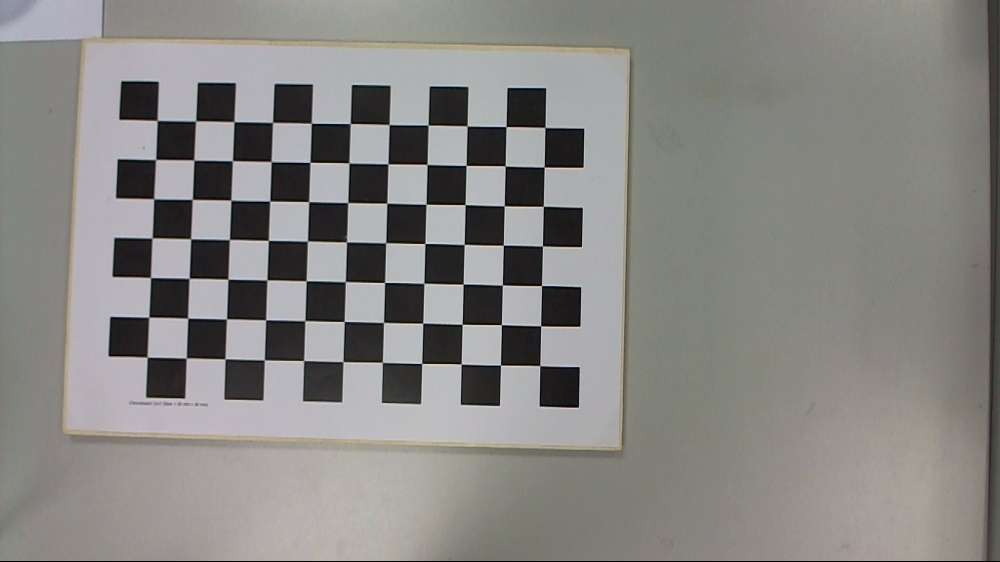
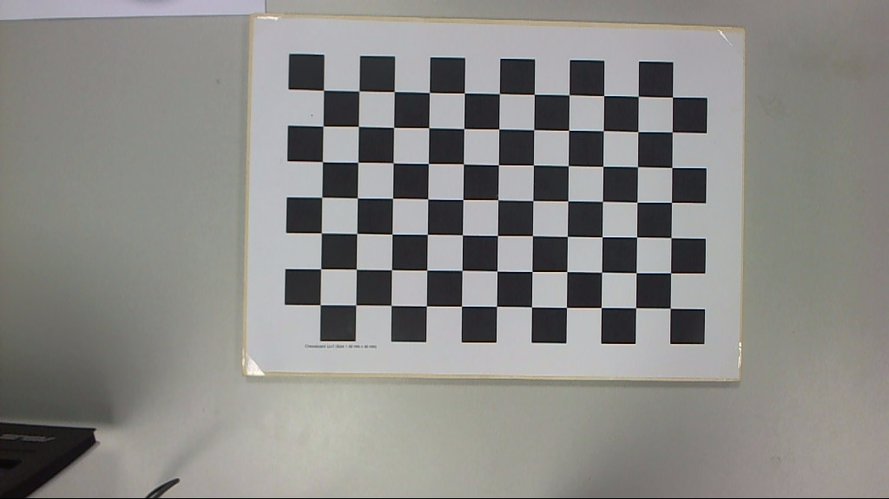
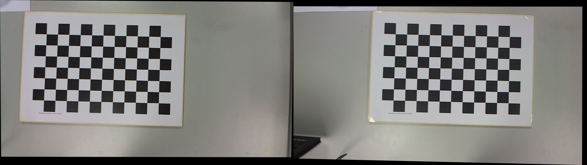

<center><h2>问题包-2</h2></center>
<div align=right>520030910246 薛家奇</div>
<br>

1. 在图中标出两对相似三角形如下：
   
   根据上图中标出的相似三角形关系，列出以下的方程：
   $$
   \begin{cases}
    &\frac{10 - 0}{0 - x_1} = \frac{10 - 4}{4 - 0}\\
    &\frac{20 - 0}{0 - y_1} = \frac{10 - 4}{4 - 0}\\
    &\frac{10 - (-5)}{(-5) - x_2} = \frac{10 - 4}{4 - 0}\\
    &\frac{20 - 0}{0 - y_2} = \frac{10 - 4}{4 - 0}
   \end{cases}
   $$
   解上述方程得到以下解：
   $$
   \begin{cases}
    &x_1 = -\frac{20}{3}\\
    &y_1 = -\frac{40}{3}\\
    &x_2 = -15\\
    &y_2 = -\frac{40}{3}
   \end{cases}
   $$
   求两个投影点在各自相片坐标系中的坐标如下，假设左右 scale factor 分别为 $f_1, f_2$：
   $$
   \begin{aligned}
    \left(x_1', y_1'\right) &= f_1\left(x_1, y_1\right) = \left(-\frac{20}{3}f_1, -\frac{40}{3}f_1\right)\\
   \left(x_2', y_2'\right) &= f_2\left(x_2 + 5, y_2\right) = \left(-10f_2, -\frac{40}{3}f_2\right)
   \end{aligned}
   $$
   计算视差如下：
   $$
   \begin{aligned}
    x_d &= \left|x_1' - x_2'\right|\\
    &= \left|-\frac{20}{3}f_1 + 10f_2\right|\\
   \end{aligned}
   $$
   当 $f_1=f_2=1$ 时，有
   $$
   d = \frac{10}{3}
   $$
   
2. 证明：
   记一本征矩阵为 $E$，则 $E$ 的定义为
   $$
   E = TR
   $$
   其中 $T$ 为 skew symmetrical matrix
   $$
   T = \begin{bmatrix}
      0 & -t_3 & t_2 \\
      t_3 & 0 & -t_1\\
      -t_2 & t_1 & 0
   \end{bmatrix}
   $$
   ，$R$ 为旋转矩阵。
   因此 $T$ 可以分解成：
   $$
   T = Q'\begin{bmatrix}
      0 & \phi & 0 \\
      -\phi & 0 & 0 \\
      0 & 0 & 0
   \end{bmatrix} Q
   $$
   其中 $\phi$ 为常实数，$Q$ 为 orthonormal matrix。
   因此有
   $$
   \begin{aligned}
      E^\top E &= R^\top T^\top T R \\
      &=\left(QR\right)^\top \begin{bmatrix}
         \phi^2 & 0 & 0 \\
         0 & \phi^2 & 0 \\
         0 & 0 & 0
      \end{bmatrix} \left(QR\right)
   \end{aligned}
   $$
   因此 $E$ 的奇异值为 $0, \phi^2,\phi^2$，即一个奇异值为 $0$ 且其他两个相等。
3. **首先进行理论推导：**
   $\mathbf{w} = \left[x, y, z\right]^\top$ 是世界坐标系中 $\mathbf{W}$ 的坐标，
   $\mathbf{m} = \left[u, v\right]^\top$ 是图像平面中 $\mathbf{M}$ 的像素坐标。
   两者之间的变换称为透视投影。 如果将两者的坐标补全为其次坐标，即
   $$
   \begin{aligned}
      \mathbf{m} &= \begin{bmatrix}
         u & v & 1
      \end{bmatrix}^\top\\
      \mathbf{w} &= \begin{bmatrix}
         x & y & z
      \end{bmatrix}^\top
   \end{aligned}
   $$
   则有 
   $$
   \lambda \mathbf{m} = \mathbf{P}\mathbf{w}
   $$
   其中 $\mathbf{P}$ 为透视投影矩阵。
   $\mathbf{P}$ 可以分解成为：
   $$
   \mathbf{P} = \mathbf{A} \left[\mathbf{R}|\mathbf{t}\right]
   $$
   其中 $\mathbf{A}$ 是相机内部参数，有如下的形式：
   $$
   \mathbf{A} = \begin{bmatrix}
      a_u & \gamma & u_0\\
      0 & \alpha_v & v_0\\
      0 & 0 & 1
   \end{bmatrix}
   $$
   其中 $\alpha_u, \alpha_v$ 分别是水平和垂直方向上的像素焦距长度。
   相机的位置 $\mathbf{t}$ 和相机的旋转矩阵 $\mathbf{R}$ 构成了表示从摄像机参考系到世界参考系的变换。
   $$
   \mathbf{P} = \begin{bmatrix}
      \mathbf{q}_1^\top & \mathbf{q}_{14}\\
      \mathbf{q}_2\top & \mathbf{q}_{24}\\
      \mathbf{q}_3^\top & \mathbf{q}_{34}\\
   \end{bmatrix} = \left[\mathbf{Q}|\mathbf{q}\right]
   $$
   则投影可以写成如下形式：
   $$
   \begin{cases}
      \mathbf{u} &= \frac{\mathbf{q}_1^\top + \mathbf{q}_{14}}{\mathbf{q}_3^\top + \mathbf{q}_{34}}
      \mathbf{v} &= \frac{\mathbf{q}_2^\top + \mathbf{q}_{24}}{\mathbf{q}_3^\top + \mathbf{q}_{34}}
   \end{cases}
   $$
   平行于像平面与过光心$\mathrm{C}$的平面叫做焦平面，$\mathrm{C}$的$ \mathbf{c}$坐标在世界坐标系$ \mathrm{W}$可表示为
   $$
   \mathbf{c} = -\mathbf{Q}^{-1}\mathbf{q}
   $$
   $$
   \mathbf{P} = \left[\mathbf{Q}|-\mathbf{Q}\mathbf{c}\right] = \mathbf{A}\left[\mathbf{R}|-\mathbf{R}\mathbf{c}\right]
   $$
   $$
   \mathbf{w} = \mathbf{c} + \lambda\mathbf{Q}^{-1}\mathbf{m}, \lambda \in \mathcal{R}
   $$
   对于双目系统中的两个投影矩阵，
   $$
   \mathbf{P}_{n1} = \mathbf{A}\left[\mathbf{R}|-\mathbf{R}\mathbf{c}_1\right]\\
   \mathbf{P}_{n2} = \mathbf{A}\left[\mathbf{R}|-\mathbf{R}\mathbf{c}_2\right]
   $$
   将旋转矩阵 $\mathbf{R}$ 表示为行向量的形式：
   $$
   \mathbf{R} = \begin{bmatrix}
      \mathbf{r}_1^\top\\
      \mathbf{r}_2^\top\\
      \mathbf{r}_3^\top\\
   \end{bmatrix}
   $$
   根据以上的关系可知：
   $$
   \begin{aligned}
      \mathbf{r}_1 &= \frac{\left(\mathbf{c}_1 - \mathbf{c}_2\right)}{\lVert \mathbf{c}_1 - \mathbf{c}_2 \rVert}\\
      \mathbf{r}_2 &= \mathbf{k} \times \mathbf{r}_1\\
      \mathbf{r}_3 &= \mathbf{r}_1 \times \mathbf{r}_2
   \end{aligned}
   $$
   下面进行矫正过程：
   $$
   \begin{cases}{{\tilde{\bf m}_{\mathrm{ol}}=\tilde{\bf P}_{\mathrm{ol}}\,\tilde{\bf w}}}\\ {{\displaystyle\tilde{\bf m}_{\mathrm{nl}}=\tilde{\bf P}_{\mathrm{n1}}\,\tilde{\bf w}}}\end{cases}
   $$
   $$
   \begin{cases}{{\mathrm{\mathbf{w}=c_{1}+\lambda_{o}\,{\bf Q}_{o}^{-1}\,\tilde{m}_{o1}~}}}\\ {{\mathrm{\mathbf{w}=c_{1}\,+\,\lambda_{n}\,{\bf Q}_{n1}^{-1}\,\tilde{m}_{o2}}}}\end{cases}
   $$
   因此
   $$
   \begin{cases}
      \mathbf{ \tilde{m}}_{n1} &= \lambda \mathbf{Q}_{n1}\mathbf{Q}_{o1}^{-1}\mathbf{\tilde{m}}_{o1}\\
      \mathbf{\tilde{m}}_{n2} &= \lambda \mathbf{Q}_{n2}\mathbf{Q}_{o2}^{-1}\mathbf{\tilde{m}}_{o2}\\
   \end{cases}
   $$

   **接下来进行编程实现：**
   > 使用的数据集来自 [Chessboard Pictures for Stereocamera Calibration](https://www.kaggle.com/datasets/danielwe14/stereocamera-chessboard-pictures)。图片文件以及参数文件在 `./data/` 文件夹中，我选择了其中的 1 号图片对进行矫正。
   
   编写以下的 [python](https://www.python.org/) 代码，分别读取左右图片 `./data/imgs/leftcamera/Im_L_1.png`，`./data/imgs/rightcamera/Im_R_1.png` 以及参数文件 `./data/out/parameters.npz`。将矫正后得到的左右图片横向拼接，并保存为 `./result.png`。
   ```py
   import numpy as np
   
   def stereoRectify(A1, A2, RT1, RT2, dims1, dims2):
       P1, P2 = A1.dot(RT1), A2.dot(RT2)
       X = [np.vstack((P1[1,:], P1[2,:])), np.vstack((P1[2,:], P1[0,:])), np.vstack((P1[0,:], P1[1,:]))]
       Y = [np.vstack((P2[1,:], P2[2,:])), np.vstack((P2[2,:], P2[0,:])), np.vstack((P2[0,:], P2[1,:]))]
       F = np.array([[np.linalg.det(np.vstack((X[j], Y[i]))) for j in range(3)] for i in range(3)])
       if np.all(np.equal(F/F[2,1], np.array([[0,0,0],[0,0,-1],[0,1,0]]))): w1 = w2 = np.array([0,0,1])
       else:
           bv = np.linalg.inv(RT2[:,:3]).dot(RT2[:,3]) - np.linalg.inv(RT1[:,:3]).dot(RT1[:,3])
           B = (bv.dot(bv) * np.eye(3) - bv[:,np.newaxis].dot(bv[np.newaxis,:])).dot(np.linalg.inv(A1.dot(RT1[:,:3])))
           L1 = np.transpose(np.linalg.inv(A1.dot(RT1[:,:3]))).dot(B)
           L2 = np.transpose(np.linalg.inv(A2.dot(RT2[:,:3]))).dot(B)
           P1 = (dims1[0]*dims1[1]/12)*np.array([[dims1[0]**2 - 1, 0, 0],[0, dims1[1]**2 - 1,0],[0, 0, 0]])
           Pc1 = np.array([[(dims1[0] - 1)**2/4, (dims1[0] - 1)*(dims1[1] - 1)/4, (dims1[0] - 1)/2],
                           [(dims1[0] - 1)*(dims1[1] - 1)/4, (dims1[1] - 1)**2/4, (dims1[1] - 1)/2],
                           [(dims1[0] - 1)/2, (dims1[1] - 1)/2, 1]])
           P2 = (dims2[0]*dims2[1]/12)*np.array([[dims2[0]**2 - 1, 0, 0],[0, dims2[1]**2 - 1,0],[0, 0, 0]])
           Pc2 = np.array([[(dims2[0] - 1)**2/4, (dims2[0] - 1)*(dims2[1] - 1)/4, (dims2[0] - 1)/2],
                           [(dims2[0] - 1)*(dims2[1] - 1)/4, (dims2[1] - 1)**2/4, (dims2[1] - 1)/2],
                           [(dims2[0] - 1)/2, (dims2[1] - 1)/2, 1]])
           M1 = L1.T.dot(P1).dot(L1)
           C1 = L1.T.dot(Pc1).dot(L1)
           M2 = L2.T.dot(P2).dot(L2)
           C2 = L2.T.dot(Pc2).dot(L2)
           m = [M1[1,2]*C1[1,2] - M1[2,2]*C1[1,1], M1[1,1]*C1[1,2] - M1[1,2]*C1[1,1]]
           if np.all(np.equal(RT1[:,:3], RT2[:,:3])) and np.all(
               np.equal(A1, A2)) and np.all(np.equal(P1, P2)) and np.all(np.equal(Pc1, Pc2)): sol = [-m[0]/m[1]]
           else:
               m += [C2[1,2]/C2[1,1], C2[1,1]/C1[1,1], 
                     M2[1,2]*C2[1,2] - M2[2,2]*C2[1,1], 
                     M2[1,1]*C2[1,2] - M2[1,2]*C2[1,1], C1[1,2]/C1[1,1], 1/(C2[1,1]/C1[1,1])]
               alpha = [m[1]*m[3] + m[5]*m[7], m[0]*m[3] + 3*m[1]*m[2]*m[3] + m[4]*m[7] + 3*m[5]*m[6]*m[7],
                   3*(m[0]*m[2]*m[3] + m[1]*m[2]**2*m[3] + m[4]*m[6]*m[7] + m[5]*m[6]**2*m[7]),
                   3*m[0]*m[2]**2*m[3] + m[1]*m[2]**3*m[3] + 3*m[4]*m[6]**2*m[7] + m[5]*m[6]**3*m[7],
                   m[0]*m[2]**3*m[3] + m[4]*m[6]**3*m[7]]
               beta = [(8*alpha[0]*alpha[2] - 3 * alpha[1]**2) / (8 * alpha[0]**2),
                   12*alpha[0]*alpha[4] - 3*alpha[1]*alpha[3] + alpha[2]**2,
                   27*alpha[0]*alpha[3]**2 - 72*alpha[0]*alpha[2
               ]*alpha[4] + 27*alpha[1]**2*alpha[4] - 9*alpha[1
               ]*alpha[2]*alpha[3] + 2*alpha[2]**3]
               Q = (1/2) * (-(2/3)*beta[0] + 1/(3*alpha[0]) * ((D0 := np.power(
                   (1/2)*(beta[2]+(beta[2]**2 - 4*beta[1]**3) ** 0.5), 1/3)) + beta[1] / D0)) ** 0.5
               S = (8*alpha[0]**2*alpha[3] - 4*alpha[0]*alpha[1]*alpha[2] + alpha[1]**3) / (8*alpha[0]**3)
               sol = ([-alpha[1] / (4*alpha[0]) - Q - (1/2)*(-4*Q**2 - 2*beta[0] + S/Q) ** 0.5,
                    -alpha[1] / (4*alpha[0]) - Q + (1/2)*(
                   -4*Q**2 - 2*beta[0] + S/Q) ** 0.5] if -4*Q**2 - 2*beta[0] + S/Q >= 0 else []) + (
                   [-alpha[1] / (4*alpha[0]) + Q - (1/2)*(
   ```
   ```py
                   -4*Q**2 - 2*beta[0] - S/Q) ** 0.5,
                    -alpha[1] / (4*alpha[0]) + Q + (1/2)*(
                   -4*Q**2 - 2*beta[0] - S/Q) ** 0.5] if -4*Q**2 - 2*beta[0] - S/Q >= 0 else [])
           w1, w2 = ((tmpfunc := lambda ss: (((tmp := (Rnew := np.array([
               (xv := bv / np.linalg.norm(bv)),
               (yv := (yv := np.cross(
               (zv := (p1w := np.linalg.inv(RT1[:,:3]).dot(
               np.linalg.inv(A1).dot(np.array(
               [0,ss,1])) - RT1[:,3])) - ((p1w + np.linalg.inv(RT2[:,:3]).dot(RT2[:,3])
               ).dot(xv) * xv - np.linalg.inv(RT2[:,:3]).dot(RT2[:,3]))), bv)) / np.linalg.norm(yv)),
               (zv := zv / np.linalg.norm(zv))])).dot(np.linalg.inv(A1.dot(RT1[:,:3])))[2,:]) / tmp[2]),
               ((tmp := Rnew.dot(np.linalg.inv(A2.dot(RT2[:,:3])))[2,:]) / tmp[2]))))(min(zip(sol,
               map(lambda x: [w := tmpfunc(x), float(w[0].dot(P1).dot(w[0])/w[0].dot(Pc1).dot(w[0])) + float(
               w[1].dot(P2).dot(w[1])/w[1].dot(Pc2).dot(w[1]))][1], sol)), key=lambda x:x[1])[0])
       vc2 = -min(
           min(((tmp := (Hp1 := np.array([[1,0,0], [0,1,0], w1])).dot(np.array([[0],[0],[1]]))[:,0]) / tmp[2])[1],
               ((tmp := Hp1.dot(np.array([[dims1[0]-1],[0],[1]]))[:,0]) / tmp[2])[1],
               ((tmp := Hp1.dot(np.array([[dims1[0]-1],[dims1[1]-1],[1]]))[:,0]) / tmp[2])[1],
               ((tmp := Hp1.dot(np.array([[0],[dims1[1]-1],[1]]))[:,0]) / tmp[2])[1]),
           min(((tmp := (Hp2 := np.array([[1,0,0], [0,1,0], w2])).dot(np.array([[0],[0],[1]]))[:,0]) / tmp[2])[1],
               ((tmp := Hp2.dot(np.array([[dims2[0]-1],[0],[1]]))[:,0]) / tmp[2])[1],
               ((tmp := Hp2.dot(np.array([[dims2[0]-1],[dims2[1]-1],[1]]))[:,0]) / tmp[2])[1],
               ((tmp := Hp2.dot(np.array([[0],[dims2[1]-1],[1]]))[:,0]) / tmp[2])[1]))
       return F, np.array([[
           ((dims1[1] *
             (x := ((tmp := (Hrp1 := np.array([ [F[2,1]-w1[1]*F[2,2], w1[0]*F[2,2]-F[2,0], 0],
                        [w1[0]*F[2,2]-F[2,0], w1[1]*F[2,2]-F[2,1], -(F[2,2] + vc2)],
                        [0, 0, 1] ]).dot(Hp1)).dot([(dims1[0] - 1),
               (dims1[1] - 1) / 2, 1])) / tmp[2]) -
              ((tmp := Hrp1.dot([0, (dims1[1] - 1) / 2, 1])) / tmp[2]))[1])**2 +
            (dims1[0] *
             (y := ((tmp := Hrp1.dot([(dims1[0] - 1) / 2,
               (dims1[1] - 1), 1])) / tmp[2]) -
              ((tmp := Hrp1.dot([(dims1[0] - 1) / 2, 0, 1])) / tmp[2]))[1])**2) /
           (dims1[0] * dims1[1] * (x[1] * y[0] - x[0] * y[1])),
           ((dims1[1]**2) * x[0] * x[1] + (dims1[0]**2) * y[0] * y[1]) /
           (dims1[0] * dims1[1] * (x[0] * y[1] - x[1] * y[0])), 0
       ], [0, 1, 0], [0, 0, 1]]).dot(Hrp1), np.array([[
           ((dims2[1] *
             (x := ((tmp := (Hrp2 := np.array([ [F[1,2]-w2[1]*F[2,2], w2[0]*F[2,2]-F[0,2], 0],
                        [F[0,2]-w2[0]*F[2,2], F[1,2]-w2[1]*F[2,2], vc2],
                        [0, 0, 1] ]).dot(Hp2)).dot([(dims2[0] - 1),
               (dims2[1] - 1) / 2, 1])) / tmp[2]) -
              ((tmp := Hrp2.dot([0, (dims2[1] - 1) / 2, 1])) / tmp[2]))[1])**2 +
            (dims2[0] *
             (y := ((tmp := Hrp2.dot([(dims2[0] - 1) / 2,
               (dims2[1] - 1), 1])) / tmp[2]) -
              ((tmp := Hrp2.dot([(dims2[0] - 1) / 2, 0, 1])) / tmp[2]))[1])**2) /
           (dims2[0] * dims2[1] * (x[1] * y[0] - x[0] * y[1])),
           ((dims2[1]**2) * x[0] * x[1] + (dims2[0]**2) * y[0] * y[1]) /
           (dims2[0] * dims2[1] * (x[0] * y[1] - x[1] * y[0])), 0
       ], [0, 1, 0], [0, 0, 1]]).dot(Hrp2)
   
   if __name__ == "__main__":
       import cv2
       img1 = cv2.imread("./data/imgs/leftcamera/Im_L_1.png")
       img2 = cv2.imread("./data/imgs/rightcamera/Im_R_1.png")
       dims1 = img1.shape[::-1][1:]
       dims2 = img2.shape[::-1][1:]
   
       data = np.load("./data/out/parameters.npz")
       A1 = data["L_Intrinsic"]
       A2 = data["R_Intrinsic"]
       RT1 = data["L_Extrinsics"][0][:-1]
       RT2 = data["R_Extrinsics"][0][:-1]
   
       distCoeffs1 = np.array([])
       distCoeffs2 = np.array([])
   
       F, Rectify1, Rectify2 = stereoRectify(A1, A2, RT1, RT2, dims1, dims2)
   
       # lpt, rpt = np.array([161, 123, 1]), np.array([373, 104, 1])
       # (a1, b1, c1), (a2, b2, c2) = F @ lpt, F @ rpt
       # cv2.line(img1, (0, round((-c1-a1*0)/b1)), (2000, round((-c1-a1*2000)/b1)), (0, 255, 0), 2)
       # cv2.line(img2, (0, round((-c2-a2*0)/b2)), (2000, round((-c2-a2*2000)/b2)), (0, 255, 0), 2)
   
       tL1, tR1, bR1, bL1 = [(x,y) for x, y in np.squeeze(cv2.undistortPoints(np.array([
           [[0,0]], [[dims1[0]-1,0]], [[dims1[0]-1,dims1[1]-1]], [[0, dims1[1]-1]]
       ], dtype=np.float32), A1, np.zeros(5) if distCoeffs1 is None else distCoeffs1, R=Rectify1.dot(A1)))]
       tL2, tR2, bR2, bL2 = [(x,y) for x, y in np.squeeze(cv2.undistortPoints(np.array([
           [[0,0]], [[dims2[0]-1,0]], [[dims2[0]-1,dims2[1]-1]], [[0, dims2[1]-1]]
       ], dtype=np.float32), A2, np.zeros(5) if distCoeffs2 is None else distCoeffs2, R=Rectify2.dot(A2)))]
       minX1, minX2 = min(tR1[0], bR1[0], bL1[0], tL1[0]), min(tR2[0], bR2[0], bL2[0], tL2[0])
       maxX1, maxX2 = max(tR1[0], bR1[0], bL1[0], tL1[0]), max(tR2[0], bR2[0], bL2[0], tL2[0])
       minY = min(tR2[1], bR2[1], bL2[1], tL2[1], tR1[1], bR1[1], bL1[1], tL1[1])
       maxY = max(tR2[1], bR2[1], bL2[1], tL2[1], tR1[1], bR1[1], bL1[1], tL1[1])
       flipX = -1 if tL1[0] > tR1[0] else 1
       flipY = -1 if tL1[1] > bL1[1] else 1
       scaleX, scaleY = flipX * dims1[0] / (maxX2 - minX2
       ) if maxX2 - minX2 > maxX1 - minX1 else flipX * dims1[0]/(maxX1 - minX1), flipY * dims1[1] / (maxY - minY)
       Fit = np.array([
           [scaleX, 0, -(min(minX1, minX2) if flipX == 1 else min(maxX1, maxX2)) * scaleX], 
           [0, scaleY, -minY * scaleY if flipY == 1 else -maxY * scaleY], 
           [0, 0, 1]])
   
       mapx1, mapy1 = cv2.initUndistortRectifyMap(A1, distCoeffs1, Rectify1.dot(A1), Fit, dims1, cv2.CV_32FC1)
       mapx2, mapy2 = cv2.initUndistortRectifyMap(A2, distCoeffs2, Rectify2.dot(A2), Fit, dims1, cv2.CV_32FC1)
       img1_rect = cv2.remap(img1, mapx1, mapy1, interpolation=cv2.INTER_LINEAR)
       img2_rect = cv2.remap(img2, mapx2, mapy2, interpolation=cv2.INTER_LINEAR)
       rectImgs = np.hstack((img1_rect, img2_rect))
   
       cv2.imwrite("result.png", rectImgs)

   ```
   读入的图片如下：
   |左图片|右图片|
   |:-:|:-:|
   |||
   输出的结果为 