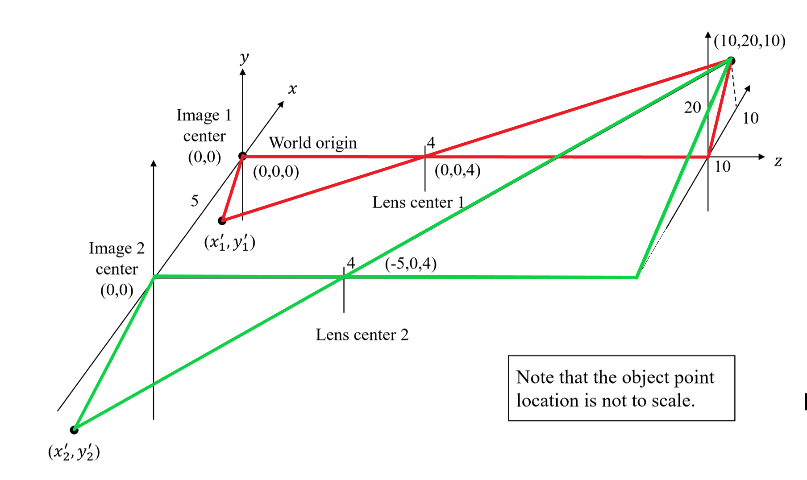
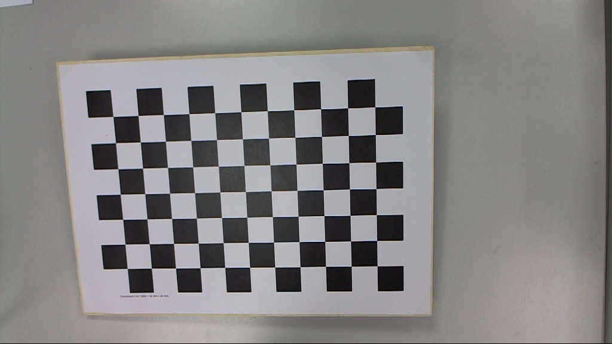
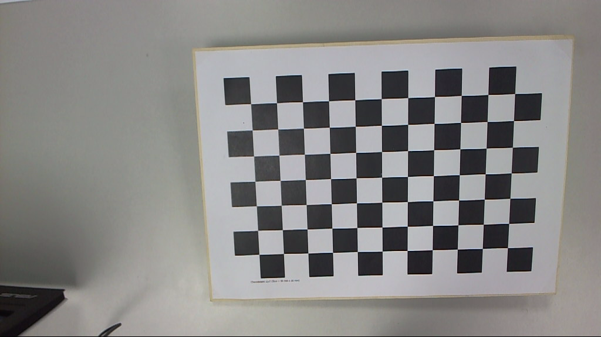
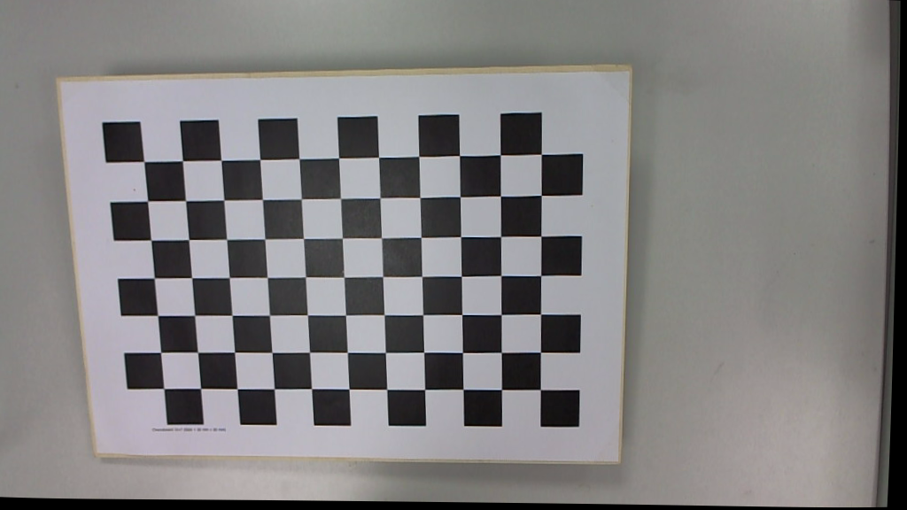
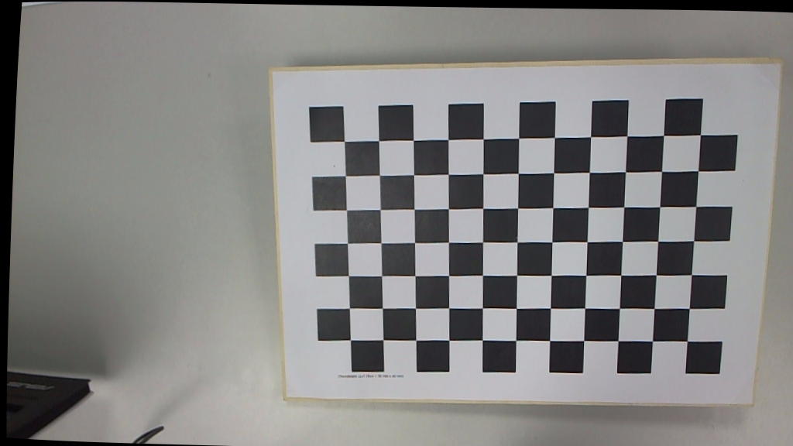

1. 在图中标出两对相似三角形如下：
   
   根据上图中标出的相似三角形关系，列出以下的方程：
   $$
   \begin{cases}
    &\frac{10 - 0}{0 - x_1'} = \frac{10 - 4}{4 - 0}\\
    &\frac{20 - 0}{0 - y_1'} = \frac{10 - 4}{4 - 0}\\
    &\frac{10 - (-5)}{(-5) - x_2'} = \frac{10 - 4}{4 - 0}\\
    &\frac{20 - 0}{0 - y_2'} = \frac{10 - 4}{4 - 0}
   \end{cases}
   $$
   解上述方程得到以下解：
   $$
   \begin{cases}
    &x_1' = -\frac{20}{3}\\
    &y_1' = -\frac{40}{3}\\
    &x_2' = -15\\
    &y_2' = -\frac{40}{3}
   \end{cases}
   $$
   求两个投影点在各自相片坐标系中的坐标如下：
   $$
   \begin{aligned}
    \left(x_1, y_1\right) &= \left(x_1', y_1'\right) = \left(-\frac{20}{3}, -\frac{40}{3}\right)\\
   \left(x_2, y_2\right) &= \left(x_2' + 5, y_2'\right) = \left(-10, -\frac{40}{3}\right)
   \end{aligned}
   $$
   计算视差如下：
   $$
   \begin{aligned}
    x_d &= \left|x_1 - x_2\right|\\
    &= \left|-\frac{20}{3} - \left(-10\right)\right|\\
    &= \frac{10}{3}\\
   \end{aligned}
   $$   
   
2. 证明：
   记一本征矩阵为 $E$，则 $E$ 的定义为
   $$
   E = TR
   $$
   其中 $T$ 为 skew symmetrical matrix
   $$
   T = \begin{bmatrix}
      0 & -t_3 & t_2 \\
      t_3 & 0 & -t_1\\
      -t_2 & t_1 & 0
   \end{bmatrix}
   $$
   ，$R$ 为旋转矩阵。
   因此 $T$ 可以分解成：
   $$
   T = Q'\begin{bmatrix}
      0 & \phi & 0 \\
      -\phi & 0 & 0 \\
      0 & 0 & 0
   \end{bmatrix} Q
   $$
   其中 $\phi$ 为常实数，$Q$ 为 orthonormal matrix。
   因此有
   $$
   \begin{aligned}
      E^\top E &= R^\top T^\top T R \\
      &=\left(QR\right)^\top \begin{bmatrix}
         \phi^2 & 0 & 0 \\
         0 & \phi^2 & 0 \\
         0 & 0 & 0
      \end{bmatrix} \left(QR\right)
   \end{aligned}
   $$
   因此 $E$ 的奇异值为 $0, \phi^2,\phi^2$，即一个奇异值为 $0$ 且其他两个相等。
3. 下面进行实验。
   使用的数据集来自 [Chessboard Pictures for Stereocamera Calibration](https://www.kaggle.com/datasets/danielwe14/stereocamera-chessboard-pictures)。我选择了其中的 15 号图片对（重命名为 `imgL.png` 和 `imgR.png`）。
   数据集中给定的内外参数矩阵如下：
   $$
   \begin{aligned}
    \text{Camera}_\text{left} &= \begin{bmatrix}
    717.67713222 & 0. & 524.32800179\\
     0. & 728.74457604 & 285.48227469\\
      0. & 0. & 1.
   \end{bmatrix}\\
   \text{Camera}_\text{right} &= \begin{bmatrix}
    721.88057791 & 0. & 513.97875605, \\
     0. & 732.52238649 & 293.09503537, \\
     0. & 0. & 1.
   \end{bmatrix}\\
   \text{distCoeffs}_\text{left} &= \begin{bmatrix}
    0.03202285\\
     -0.17513817\\
     0.00090401\\
     0.00048527\\
     0.19902392
   \end{bmatrix}\\
   \text{distCoeffs}_\text{right} &= \begin{bmatrix}
    0.00878113\\
    -0.12596223\\
    -0.00143747\\
    0.00142956\\
    0.18402501
   \end{bmatrix}\\
   \text{R} &= \begin{bmatrix}
    0.99937181 & 0.00763664 & -0.03460732\\
     -0.00856809 & 0.99960284 & -0.02684689\\ 
     0.03438855 & 0.02712655 & 0.99904033
   \end{bmatrix}\\
   \text{T} &= \begin{bmatrix}
    189.73626102\\
    -4.52649875\\
    4.79116498
   \end{bmatrix}
   \end{aligned}
   $$
   参照 [opencv](https://github.com/opencv/opencv) 的源码，编写如下的 C++ 代码 (`StereoRectify.cpp`)：
   ```cpp
    #include <opencv2/opencv.hpp>
    #include <opencv2/core/core_c.h>
    using namespace cv;

    static void icvGetRectangles(const CvMat* cameraMatrix, const CvMat* distCoeffs,
        const CvMat* R, const CvMat* newCameraMatrix, CvSize imgSize,
        cv::Rect_<float>& inner, cv::Rect_<float>& outer) {
        const int N = 9;
        int x, y, k;
        cv::Ptr<CvMat> _pts(cvCreateMat(1, N * N, CV_32FC2));
        CvPoint2D32f* pts = (CvPoint2D32f*)(_pts->data.ptr);

        for (y = k = 0; y < N; y++)
            for (x = 0; x < N; x++)
                pts[k++] = cvPoint2D32f((float)x * imgSize.width / (N - 1),
                    (float)y * imgSize.height / (N - 1));

        undistortPoints(
            cvarrToMat(_pts),
            cvarrToMat(_pts),
            cvarrToMat(cameraMatrix),
            cvarrToMat(distCoeffs),
            cvarrToMat(R),
            cvarrToMat(newCameraMatrix)
        );

        float iX0 = -FLT_MAX, iX1 = FLT_MAX, iY0 = -FLT_MAX, iY1 = FLT_MAX;
        float oX0 = FLT_MAX, oX1 = -FLT_MAX, oY0 = FLT_MAX, oY1 = -FLT_MAX;

        for (y = k = 0; y < N; y++)
            for (x = 0; x < N; x++)
            {
                CvPoint2D32f p = pts[k++];
                oX0 = MIN(oX0, p.x);
                oX1 = MAX(oX1, p.x);
                oY0 = MIN(oY0, p.y);
                oY1 = MAX(oY1, p.y);

                if (x == 0)
                    iX0 = MAX(iX0, p.x);
                if (x == N - 1)
                    iX1 = MIN(iX1, p.x);
                if (y == 0)
                    iY0 = MAX(iY0, p.y);
                if (y == N - 1)
                    iY1 = MIN(iY1, p.y);
            }
        inner = cv::Rect_<float>(iX0, iY0, iX1 - iX0, iY1 - iY0);
        outer = cv::Rect_<float>(oX0, oY0, oX1 - oX0, oY1 - oY0);
    }

    void cvStereoRectify(const CvMat* _cameraMatrix1, const CvMat* _cameraMatrix2,
        const CvMat* _distCoeffs1, const CvMat* _distCoeffs2,
        CvSize imageSize, const CvMat* matR, const CvMat* matT,
        CvMat* _R1, CvMat* _R2, CvMat* _P1, CvMat* _P2,
        CvMat* matQ, int flags, double alpha, CvSize newImgSize,
        CvRect* roi1, CvRect* roi2)
    {
        double _om[3], _t[3] = { 0 }, _uu[3] = { 0,0,0 }, _r_r[3][3], _pp[3][4];
        double _ww[3], _wr[3][3], _z[3] = { 0,0,0 }, _ri[3][3];
        cv::Rect_<float> inner1, inner2, outer1, outer2;

        CvMat om = cvMat(3, 1, CV_64F, _om);
        CvMat t = cvMat(3, 1, CV_64F, _t);
        CvMat uu = cvMat(3, 1, CV_64F, _uu);
        CvMat r_r = cvMat(3, 3, CV_64F, _r_r);
        CvMat pp = cvMat(3, 4, CV_64F, _pp);
        CvMat ww = cvMat(3, 1, CV_64F, _ww);
        CvMat wR = cvMat(3, 3, CV_64F, _wr);
        CvMat Z = cvMat(3, 1, CV_64F, _z);
        CvMat Ri = cvMat(3, 3, CV_64F, _ri);
        double nx = imageSize.width, ny = imageSize.height;
        int i, k;

        if (matR->rows == 3 && matR->cols == 3)
            Rodrigues(cvarrToMat(matR), cvarrToMat(&om));
        else
            cvConvert(matR, &om);
        cvConvertScale(&om, &om, -0.5); 
        Rodrigues(cvarrToMat(&om), cvarrToMat(&r_r));
        cvMatMul(&r_r, matT, &t);

        int idx = fabs(_t[0]) > fabs(_t[1]) ? 0 : 1;
        double c = _t[idx], nt = cvNorm(&t, 0, CV_L2);
        _uu[idx] = c > 0 ? 1 : -1;

        CV_Assert(nt > 0.0);
        cvCrossProduct(&t, &uu, &ww);
        double nw = cvNorm(&ww, 0, CV_L2);
        if (nw > 0.0)
            cvConvertScale(&ww, &ww, acos(fabs(c) / nt) / nw);
        Rodrigues(cvarrToMat(&ww), cvarrToMat(&wR));
        cvGEMM(&wR, &r_r, 1, 0, 0, &Ri, CV_GEMM_B_T);
        cvConvert(&Ri, _R1);
        cvGEMM(&wR, &r_r, 1, 0, 0, &Ri, 0);
        cvConvert(&Ri, _R2);
        cvMatMul(&Ri, matT, &t);
        double fc_new = DBL_MAX;
        CvPoint2D64f cc_new[2] = {};

        newImgSize = newImgSize.width * newImgSize.height != 0 ? newImgSize : imageSize;
        const double ratio_x = (double)newImgSize.width / imageSize.width / 2;
        const double ratio_y = (double)newImgSize.height / imageSize.height / 2;
        const double ratio = idx == 1 ? ratio_x : ratio_y;
        fc_new = (
            cvmGet(_cameraMatrix1, idx ^ 1, idx ^ 1) + cvmGet(_cameraMatrix2, idx ^ 1, idx ^ 1)
        ) * ratio;

        for (k = 0; k < 2; k++)
        {
            const CvMat* A = k == 0 ? _cameraMatrix1 : _cameraMatrix2;
            const CvMat* Dk = k == 0 ? _distCoeffs1 : _distCoeffs2;
            CvPoint2D32f _pts[4] = {};
            CvPoint3D32f _pts_3[4] = {};
            CvMat pts = cvMat(1, 4, CV_32FC2, _pts);
            CvMat pts_3 = cvMat(1, 4, CV_32FC3, _pts_3);

            for (i = 0; i < 4; i++)
            {
                int j = (i < 2) ? 0 : 1;
                _pts[i].x = (float)((i % 2) * (nx - 1));
                _pts[i].y = (float)(j * (ny - 1));
            }
            undistortPoints(cvarrToMat(&pts), cvarrToMat(&pts), cvarrToMat(A), cvarrToMat(Dk), 0, 0);
            convertPointsHomogeneous(cvarrToMat(&pts), cvarrToMat(&pts_3));
            double _a_tmp[3][3];
            CvMat A_tmp = cvMat(3, 3, CV_64F, _a_tmp);
            _a_tmp[0][0] = fc_new;
            _a_tmp[1][1] = fc_new;
            _a_tmp[0][2] = 0.0;
            _a_tmp[1][2] = 0.0;
            projectPoints(
                cvarrToMat(&pts_3), 
                cvarrToMat(k == 0 ? _R1 : _R2), 
                cvarrToMat(&Z), 
                cvarrToMat(&A_tmp), 
                0, 
                cvarrToMat(&pts)
            );
            CvScalar avg = cvAvg(&pts);
            cc_new[k].x = (nx - 1) / 2 - avg.val[0];
            cc_new[k].y = (ny - 1) / 2 - avg.val[1];
        }

        if (flags & CALIB_ZERO_DISPARITY)
        {
            cc_new[0].x = cc_new[1].x = (cc_new[0].x + cc_new[1].x) * 0.5;
            cc_new[0].y = cc_new[1].y = (cc_new[0].y + cc_new[1].y) * 0.5;
        }
        else if (idx == 0)
            cc_new[0].y = cc_new[1].y = (cc_new[0].y + cc_new[1].y) * 0.5;
        else
            cc_new[0].x = cc_new[1].x = (cc_new[0].x + cc_new[1].x) * 0.5;

        cvZero(&pp);
        _pp[0][0] = _pp[1][1] = fc_new;
        _pp[0][2] = cc_new[0].x;
        _pp[1][2] = cc_new[0].y;
        _pp[2][2] = 1;
        cvConvert(&pp, _P1);

        _pp[0][2] = cc_new[1].x;
        _pp[1][2] = cc_new[1].y;
        _pp[idx][3] = _t[idx] * fc_new;
        cvConvert(&pp, _P2);

        alpha = MIN(alpha, 1.);

        icvGetRectangles(_cameraMatrix1, _distCoeffs1, _R1, _P1, imageSize, inner1, outer1);
        icvGetRectangles(_cameraMatrix2, _distCoeffs2, _R2, _P2, imageSize, inner2, outer2);

        {
            newImgSize = newImgSize.width * newImgSize.height != 0 ? newImgSize : imageSize;
            double cx1_0 = cc_new[0].x;
            double cy1_0 = cc_new[0].y;
            double cx2_0 = cc_new[1].x;
            double cy2_0 = cc_new[1].y;
            double cx1 = newImgSize.width * cx1_0 / imageSize.width;
            double cy1 = newImgSize.height * cy1_0 / imageSize.height;
            double cx2 = newImgSize.width * cx2_0 / imageSize.width;
            double cy2 = newImgSize.height * cy2_0 / imageSize.height;
            double s = 1.;

            if (alpha >= 0)
            {
                double s0 = std::max(
                    std::max(std::max((double)cx1 / 
                    (cx1_0 - inner1.x), (double)cy1 / (cy1_0 - inner1.y)),
                    (double)(newImgSize.width - cx1) / (inner1.x + inner1.width - cx1_0)),
                    (double)(newImgSize.height - cy1) / (inner1.y + inner1.height - cy1_0));
                s0 = std::max(std::max(
                    std::max(std::max((double)cx2 / 
                    (cx2_0 - inner2.x), (double)cy2 / (cy2_0 - inner2.y)),
                    (double)(newImgSize.width - cx2) / (inner2.x + inner2.width - cx2_0)),
                    (double)(newImgSize.height - cy2) / (inner2.y + inner2.height - cy2_0)),
                    s0);

                double s1 = std::min(std::min(
                    std::min((double)cx1 / 
                    (cx1_0 - outer1.x), (double)cy1 / (cy1_0 - outer1.y)),
                    (double)(newImgSize.width - cx1) / (outer1.x + outer1.width - cx1_0)),
                    (double)(newImgSize.height - cy1) / (outer1.y + outer1.height - cy1_0));
                s1 = std::min(std::min(std::min(
                    std::min((double)cx2 / 
                    (cx2_0 - outer2.x), (double)cy2 / (cy2_0 - outer2.y)),
                    (double)(newImgSize.width - cx2) / (outer2.x + outer2.width - cx2_0)),
                    (double)(newImgSize.height - cy2) / (outer2.y + outer2.height - cy2_0)),
                    s1);

                s = s0 * (1 - alpha) + s1 * alpha;
            }

            fc_new *= s;
            cc_new[0] = cvPoint2D64f(cx1, cy1);
            cc_new[1] = cvPoint2D64f(cx2, cy2);

            cvmSet(_P1, 0, 0, fc_new);
            cvmSet(_P1, 1, 1, fc_new);
            cvmSet(_P1, 0, 2, cx1);
            cvmSet(_P1, 1, 2, cy1);

            cvmSet(_P2, 0, 0, fc_new);
            cvmSet(_P2, 1, 1, fc_new);
            cvmSet(_P2, 0, 2, cx2);
            cvmSet(_P2, 1, 2, cy2);
            cvmSet(_P2, idx, 3, s * cvmGet(_P2, idx, 3));
        }
    }

    void stereoRectify(InputArray _cameraMatrix1, InputArray _distCoeffs1,
        InputArray _cameraMatrix2, InputArray _distCoeffs2,
        Size imageSize, InputArray _Rmat, InputArray _Tmat,
        OutputArray _Rmat1, OutputArray _Rmat2,
        OutputArray _Pmat1, OutputArray _Pmat2,
        OutputArray _Qmat, int flags,
        double alpha = -1, Size newImageSize = Size(),
        Rect* validPixROI1 = 0, Rect* validPixROI2 = 0)
    {
        Mat cameraMatrix1 = _cameraMatrix1.getMat(), cameraMatrix2 = _cameraMatrix2.getMat();
        Mat distCoeffs1 = _distCoeffs1.getMat(), distCoeffs2 = _distCoeffs2.getMat();
        Mat Rmat = _Rmat.getMat(), Tmat = _Tmat.getMat();
        CvMat c_cameraMatrix1 = cvMat(cameraMatrix1);
        CvMat c_cameraMatrix2 = cvMat(cameraMatrix2);
        CvMat c_distCoeffs1 = cvMat(distCoeffs1);
        CvMat c_distCoeffs2 = cvMat(distCoeffs2);
        CvMat c_R = cvMat(Rmat), c_T = cvMat(Tmat);

        int rtype = CV_64F;
        _Rmat1.create(3, 3, rtype);
        _Rmat2.create(3, 3, rtype);
        _Pmat1.create(3, 4, rtype);
        _Pmat2.create(3, 4, rtype);
        Mat R1 = _Rmat1.getMat(), R2 = _Rmat2.getMat(), P1 = _Pmat1.getMat(), P2 = _Pmat2.getMat(), Q;
        CvMat c_R1 = cvMat(R1), c_R2 = cvMat(R2), c_P1 = cvMat(P1), c_P2 = cvMat(P2);
        CvMat c_Q, * p_Q = 0;

        if (_Qmat.needed())
        {
            _Qmat.create(4, 4, rtype);
            p_Q = &(c_Q = cvMat(Q = _Qmat.getMat()));
        }

        CvMat* p_distCoeffs1 = distCoeffs1.empty() ? NULL : &c_distCoeffs1;
        CvMat* p_distCoeffs2 = distCoeffs2.empty() ? NULL : &c_distCoeffs2;
        cvStereoRectify(&c_cameraMatrix1, &c_cameraMatrix2, p_distCoeffs1, p_distCoeffs2,
            cvSize(imageSize), &c_R, &c_T, &c_R1, &c_R2, &c_P1, &c_P2, p_Q, flags, alpha,
            cvSize(newImageSize), (CvRect*)validPixROI1, (CvRect*)validPixROI2);
    }


    int main() {
        Mat imgLeft = imread("imgL.png");
        Mat imgRight = imread("imgR.png");

        Mat cameraMatrixLeft = (Mat_<double>(3, 3) << 

        717.67713222, 0., 524.32800179, 
        0., 728.74457604, 285.48227469, 
        0., 0., 1.);

        Mat cameraMatrixRight = (Mat_<double>(3, 3) << 
        
        721.88057791, 0., 513.97875605, 
        0., 732.52238649, 293.09503537, 
        0., 0., 1.);

        Mat distCoeffsLeft = (Mat_<double>(1, 5) << 
        0.03202285, -0.17513817, 0.00090401, 0.00048527, 0.19902392);
        Mat distCoeffsRight = (Mat_<double>(1, 5) << 
        0.00878113, -0.12596223, -0.00143747, 0.00142956, 0.18402501);

        Mat R = (Mat_<double>(3, 3) << 

        0.99937181, 0.00763664, -0.03460732, 
        -0.00856809, 0.99960284, -0.02684689, 
        0.03438855, 0.02712655, 0.99904033);

        Mat T = (Mat_<double>(3, 1) << 189.73626102, -4.52649875, 4.79116498);

        Mat R1, R2, P1, P2, Q;
        stereoRectify(
            cameraMatrixLeft,
            distCoeffsLeft, 
            cameraMatrixRight, 
            distCoeffsRight, 
            imgLeft.size(), 
            R, T, R1, R2, P1, P2, Q);

        Mat mapLeftX, mapLeftY, mapRightX, mapRightY;
        initUndistortRectifyMap(
            cameraMatrixLeft, 
            distCoeffsLeft, 
            R1, P1, imgLeft.size(), CV_32FC1, mapLeftX, mapLeftY);
        initUndistortRectifyMap(
            cameraMatrixRight, 
            distCoeffsRight, 
            R2, P2, imgRight.size(), CV_32FC1, mapRightX, mapRightY);

        Mat imgLeftRect, imgRightRect;
        remap(imgLeft, imgLeftRect, mapLeftX, mapLeftY, INTER_LINEAR);
        remap(imgRight, imgRightRect, mapRightX, mapRightY, INTER_LINEAR);

        imwrite("rectifiedL.png", imgLeftRect);
        imwrite("rectifiedR.png", imgRightRect);

        namedWindow("Left Rectified");
        namedWindow("Right Rectified");
        imshow("Left Rectified", imgLeftRect);
        imshow("Right Rectified", imgRightRect);
        waitKey(0);
        return 0;
    }
   ```
   编译后的可执行文件及其依赖项在 `dist` 文件夹中，运行命令
   ```bash
   dist\StereoRectify.exe
   ```
   得到实验结果，总结如下表：
   ||左|右|
   |:-:|:-:|:-:|
   |**矫正前**|||
   |**矫正后**||
