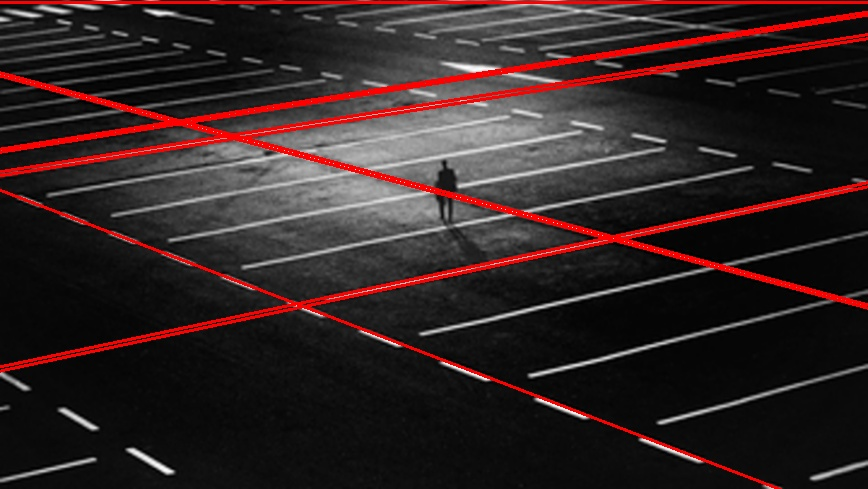

<script src="https://cdnjs.cloudflare.com/ajax/libs/KaTeX/0.11.1/katex.min.js"
        integrity="sha256-F/Xda58SPdcUCr+xhSGz9MA2zQBPb0ASEYKohl8UCHc=" crossorigin="anonymous">
</script>
<link rel="stylesheet" href="https://cdn.jsdelivr.net/npm/pseudocode@latest/build/pseudocode.min.css">
<script src="https://cdn.jsdelivr.net/npm/pseudocode@latest/build/pseudocode.min.js">
</script>

<center><h2>问题包-3</h2></center>
<div align=right>520030910246 薛家奇</div>
<br>

1. 存在一个与直线垂直的向量 $\mathbf{v}$：
   $$
    \mathbf{v} = \begin{bmatrix}
    a\\b
   \end{bmatrix}
   $$
   从点 $(u, v)$ 到直线上任意一点 $(x, y)$ 的向量 $\mathbf{r}$ 为：
   $$
   \mathbf{r} = \begin{bmatrix}
    x-u\\y-v
   \end{bmatrix}
   $$
   
   则点 $(u, v)$ 到直线 $ax+by+c=0$ 的距离 $d$ 为， $\mathbf{r}$ 在 $\mathbf{v}$ 方向上的投影长度：
   $$
   \begin{aligned}
    d &= \lvert \text{proj}_\mathbf{v}\mathbf{r} \rvert\\
    &= \frac{\lvert \mathbf{v}\cdot \mathbf{r}\rvert}{\lvert \mathbf{v}\rvert}\\
    &= \frac{\lvert a\left( x-u \right) + b\left(y-v\right) \rvert}{\sqrt{a^2+b^2}}\\
    &= \frac{\lvert ax + by -au -bv \rvert}{\sqrt{a^2+b^2}}\\
    &=\frac{\lvert au+bv+c\rvert}{\sqrt{a^2+b^2}}\\
    &= \lvert au+bv+c \rvert
   \end{aligned}
   $$
2. 给定一个高斯混合模型，目标是针对参数最大化似然函数。
   - 初始化均值 $\mu$、协方差 $\Sigma$ 和混合系数 $\pi$，并计算初始对数似然函数的值。
   - E步：计算每个数据点来自于每个高斯分布的概率，并根据这些概率重新估计隐变量的值。
      $$
      w_{ij} = \frac{\pi_{j}N(x_1|\mu_j, \Sigma_j)}{\sum\limits_{k}\pi_kN(x_i|\mu_k, \Sigma_k)}
      $$
      其中，$w_{ij}$ 表示第 $i$ 个数据点来自第 $j$ 个高斯分布的概率，$x_i$ 表示第 $i$ 个数据点，$\mu_j$ 和 $\Sigma_j$ 分别表示第 $j$ 个高斯分布的均值和方差，$\pi_j$ 表示第 $j$ 个高斯分布的混合系数，$N(x_i| \mu_j, \Sigma_j)$ 表示 $x_i$ 在第 $j$ 个高斯分布下的概率密度函数。
   - M步：根据已知的隐变量和数据，重新估计每个高斯分布的均值、方差和混合系数。
      $$
      \mu_j = \frac{\sum\limits_{i=1}^n w_{ij}x_i}{\sum\limits_{i=1}^nw_{ij}}\\
      \Sigma_j = \frac{\sum\limits_{i=1}^nw_{ij}(x_i-\mu_j)(x_i-\mu_j)^\top}{\sum\limits_{i=1}^nw_{ij}}\\
      \pi_j = \frac{1}{n}\sum\limits_{i=1}^nw_{ij}
      $$
      其中，$\mu_j$ 和 $\Sigma_j$ 分别表示第 $j$ 个高斯分布的均值和方差，$\pi_j$ 表示第 $j$ 个高斯分布的混合系数，$w_{ij}$ 表示第 $i$ 个数据点来自于第 $j$ 个高斯分布的概率。
   - 计算对数似然函数并检查收敛性。
3. 图像分割 Mean-shift 的算法流程伪代码如下：
   <pre id="Mean-shift" class="pseudocode" style="display:hidden;">
       \begin{algorithm}
       \caption{Mean-shift}
       \begin{algorithmic}
       \Require 图像 $I$，窗口大小 $r$，均值漂移阈值 $T$
       \Ensure 分割结果 $S$
       \For{每个像素 $p$ in 图像 $I$}
       \State 将以 $p$ 为中心，半径为 $r$ 的窗口定义为当前窗口
       \State 初始化漂移向量 $shift = (0, 0)$
       \State 初始化权重总和 $weight_sum = 0$
       \State 初始化当前窗口内像素值的加权平均值 $mean = (0, 0, 0)$
       \Repeat
       \State 将漂移向量 $shift$ 清零
       \State 将权重总和 $weight_sum$ 清零
       \State 将当前窗口内每个像素 $q$ 都遍历一遍
       \For{每个像素 $q$ in 当前窗口}
       \State 计算像素 $q$ 到中心像素 $p$ 的距离 $d$
       \If{$d < r$}
       \State 将像素 $q$ 的权重 $w$ 设为高斯核函数的值
       \Else
       \State 将像素 $q$ 的权重 $w$ 设为0
       \EndIf
       \State 将漂移向量 $shift$ 按照像素 $q$ 的位置和权重进行加权累加
       \State 将权重总和 $weight_sum$ 按照像素 $q$ 的权重进行累加
       \State 将像素 $q$ 的颜色值按照权重 $w$ 进行加权并累加到 $mean$ 中
       \EndFor
       \State 将漂移向量 $shift$ 除以权重总和 $weight_sum$，得到归一化漂移向量 $shift_norm$
       \State 将中心像素 $p$ 的坐标加上漂移向量 $shift_norm$，得到新的中心像素 $p$
       \Until{$||shift|| < T$}
       \State 将当前窗口内的像素全部标记为分割结果 $S$ 中的一个分割区域
       \EndFor
       \State 返回分割结果 $S$
       \end{algorithmic}
       \end{algorithm}
   </pre>
   <script>
       pseudocode.renderElement(document.getElementById("Mean-shift"));
   </script>

   影响算法性能的主要因素如下：
   - 窗口大小：窗口大小决定了算法的搜索范围和像素点的聚集程度。如果窗口过小，可能导致聚集不足，分割结果不准确；如果窗口过大，可能导致聚集过度，计算复杂度过高。因此，合理选择窗口大小非常重要。
   - 高斯核函数参数：高斯核函数参数 $\sigma$ 决定了像素点权重的分布。如果参数设置过小，会使得权重分布过于集中，导致分割结果不准确；如果参数设置过大，会使得权重分布过于平均，导致分割结果模糊不清。
   - 均值漂移阈值：均值漂移阈值 $T$ 决定了均值漂移的停止条件。如果阈值设置过小，均值漂移次数过多，导致计算复杂度过高；如果阈值设置过大，均值漂移停止过早，导致分割结果不准确。
   - 初始点选取策略：算法的初始点选取策略会影响算法的收敛速度和分割结果的准确性。如果初始点选择不合理，可能导致均值漂移过程过程过长或者过短，导致分割结果不准确。
   - 图像大小和分辨率：图像大小和分辨率决定了算法的计算复杂度。如果图像过大或者分辨率过高，可能导致算法计算时间过长，难以实时处理。

4. 编写如下的 [python](https://www.python.org/) 代码，对霍夫变换的参数 `rho`，`theta`，`threshold` 进行遍历，将全部结果图片保存在 `./HoughResult` 文件夹中。并将每张结果图片对应的线条的数目记录在 `./HoughResult/index.json` 文件中。
   （实际的参数 `theta` 是结果图片的文件名中的 `_theta` 进行 `_theta * np.pi / 180` 计算后的值。）
   ```py
   import cv2, numpy as np, os, json
   from itertools import product
   
   def hough(_rho, _theta, _threshold):
       img_lines = img.copy()
       lines = cv2.HoughLines(edges, _rho, _theta, _threshold)
       if lines is None: return img_lines, 0
       num_lines = len(lines)
       for line in lines:
           rho, theta = line[0]
           a = np.cos(theta)
           b = np.sin(theta)
           x0 = a * rho
           y0 = b * rho
           x1 = int(x0 + l * (-b))
           y1 = int(y0 + l * (a))
           x2 = int(x0 - l * (-b))
           y2 = int(y0 - l * (a))
           cv2.line(img_lines, (x1, y1), (x2, y2), (0, 0, 255), 2)
       return img_lines, num_lines
   
   if __name__ == '__main__':
       result_path = "HoughResult"
       if not os.path.exists(result_path): os.makedirs(result_path)
       img = cv2.imread('lines.png')
       l = 2*max(img.shape)
       gray = cv2.cvtColor(img, cv2.COLOR_BGR2GRAY)
       edges = cv2.Canny(gray, 80, 220, apertureSize=3)
       data_idx = {}
       for rho, _theta, threshold in product(range(1, 6), range(1, 6), range(170, 250, 20)):
           theta = _theta * np.pi / 180
           img_name = f"rho={rho};_theta={_theta};threshold={threshold}.jpg"
           img_lines, line_count = hough(rho, theta, threshold)
           cv2.imwrite(os.path.join(result_path, img_name), img_lines)
           data_idx[img_name] = line_count
       with open(os.path.join(result_path, "index.json"), "w", encoding="utf-8") as f:
           json.dump(data_idx, f, indent=4, ensure_ascii=False)
   ```
   程序读取的原图如下：
   
   考虑到结果图片过多（在`./HoughResult` 文件夹中有 100 张结果图片），在报告中仅挑选其中有代表性的图片及其参数进行分析。
   首先对参数 `threshold` 进行分析，固定 `rho` = 1, `theta` = $\frac{\pi}{180}$，对 `threshold` 进行遍历，结果如下表：
   |文件名|线条数目|结果图片|
   |-|-|-|
   |`"rho=1;_theta=1;threshold=170.jpg"`| 33||
   |`"rho=1;_theta=1;threshold=190.jpg"`| 28||
   |`"rho=1;_theta=1;threshold=210.jpg"`| 20||
   |`"rho=1;_theta=1;threshold=230.jpg"`| 16||
   可以看出，随着 `threshold` 的不断增加，检测结果中的线条数目逐渐减少。

   接下来对参数 `theta` 与 `rho` 进行分析，固定 `rho` = 1, `threshold` = 210，对 `theta` 进行遍历，结果如下表：
   |文件名|线条数目|结果图片|
   |-|-|-|
   |`"rho=1;_theta=1;threshold=210.jpg"`| 20  ||
   |`"rho=1;_theta=2;threshold=210.jpg"`| 9   ||
   |`"rho=1;_theta=3;threshold=210.jpg"`| 10  ||
   |`"rho=1;_theta=4;threshold=210.jpg"`| 2   ||
   |`"rho=1;_theta=5;threshold=210.jpg"`| 5   ||
   固定 `theta` = 1, `threshold` = 210，对 `rho` 进行遍历，结果如下表：
   |文件名|线条数目|结果图片|
   |-|-|-|
   |`"rho=1;_theta=1;threshold=210.jpg"`| 20||
   |`"rho=2;_theta=1;threshold=210.jpg"`| 80||
   |`"rho=3;_theta=1;threshold=210.jpg"`| 310||
   |`"rho=4;_theta=1;threshold=210.jpg"`| 487||
   |`"rho=5;_theta=1;threshold=210.jpg"`| 696||
   根据上述结果可以进行分析：`rho` 和 `theta` 的步长参数会影响霍夫变换空间的分辨率。步长越小，分辨率越高，但计算量也会增加。如果步长过大，可能会导致检测不到细微的直线，步长过小，则可能会检测到过多的噪声。

5. 编写如下的 [python](https://www.python.org/) 代码，读取图像，进行线拟合。考虑到原始图像中文字行的方向都是水平的，因此在进行线拟合的过程中只进行每条直线的偏置项的拟合即可。最后根据拟合结果在原始图像上添加删除线，保存为另一幅图片。
   ```py
   import cv2
   import numpy as np
   from itertools import groupby
   
   img = cv2.imread("./text.png")
   thresh = cv2.threshold(cv2.cvtColor(img, cv2.COLOR_BGR2GRAY), 0, 255, cv2.THRESH_BINARY_INV + cv2.THRESH_OTSU)[1]
   
   for val, elems in groupby(
      ((np.sum(thresh[x]) > 100, x) for x in range(thresh.shape[0])),
      key=lambda x:x[0]
   ):
       if not val: continue
       elems = list(elems)
       start, end = elems[0][1], elems[-1][1]
       tmp = np.where(np.sum(thresh[start:end], axis=0) > 100)[0]
       mean = round(sum(np.sum(thresh[i]) * i for i in range(start, end)) / np.sum(thresh[start:end]))
       cv2.line(img, (tmp[0], mean), (tmp[-1], mean), (0, 0, 255), (end - start) // 10 + 1)
   
   cv2.imwrite("./delete-text.png", img)
   ```
   |程序读取的原图|程序输出的结果|
   |:-:|:-:|
   |||