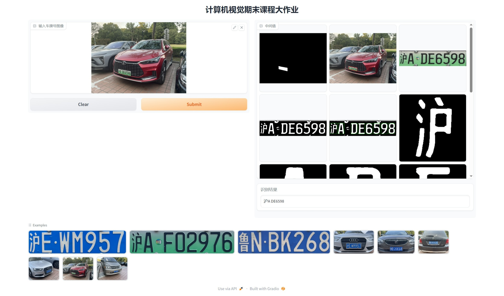

# 车牌号的视觉识别

## 环境配置
要求 `python>=3.8`，`pytorch>=1.7` 且 `torchvision>=0.8`. 请根据 [这里](https://pytorch.org/get-started/locally/) 安装 PyTorch 和 TorchVision 依赖项。 强烈建议安装 CUDA 版本的 PyTorch 和 TorchVision。
要求 [`git`](https://git-scm.com/) 可用。

满足上述要求后，安装依赖项：
```bash
pip install -r requirements.txt
```

## 模型文件下载
下载 **[segment-anything](https://github.com/facebookresearch/segment-anything)** 提供的 `sam_vit_h_4b8939.pth` 模型文件
**下载链接：** https://dl.fbaipublicfiles.com/segment_anything/sam_vit_h_4b8939.pth
（约 2.4G 大小）
放置于根目录下（即与 `main.py` 同目录）

## 训练数据集来源
> 1. 车牌字符数据集 - 飞桨AI Studio https://aistudio.baidu.com/aistudio/datasetdetail/18414
> 2. 车牌识别数据集 - 飞桨AI Studio https://aistudio.baidu.com/aistudio/datasetdetail/56280
> 3. 参照 https://github.com/derek285/generateCarPlate 项目，自己生成了部分数据集

将全部数据集放置在 `./data` 文件夹中，呈以下结构：
```text
├─data
   ├─0
   ├─1
   ├─2
   # ... 省略若干文件夹
   ├─yun
   ├─Z
   ├─zang
   └─zhe
```

## 快速开始
1. **(Optional)** 用 `./data` 中的数据，训练数字字母识别模型：
   ```bash
   python cnn_chr_model.py
   ```
   得到 `chr_net.pth` 模型文件 **（本项目已提供）**
2. **(Optional)** 用 `./data` 中的数据，训练省份汉字识别模型：
   ```bash
   python cnn_provi_model.py
   ```
   得到 `provi_net.pth` 模型文件 **（本项目已提供）**
3. 对课程作业提供的 9 张车牌图片进行预测：
   要求（`./provi_net.pth`, `./chr_net.pth`, `./sam_vit_h_4b8939.pth`）可用
   ```bash
   python main.py
   ```
4. 运行 WebUI
   要求（`./provi_net.pth`, `./chr_net.pth`, `./sam_vit_h_4b8939.pth`）可用
   ```bash
   python app.py
   ```
   网页示例如下：
   